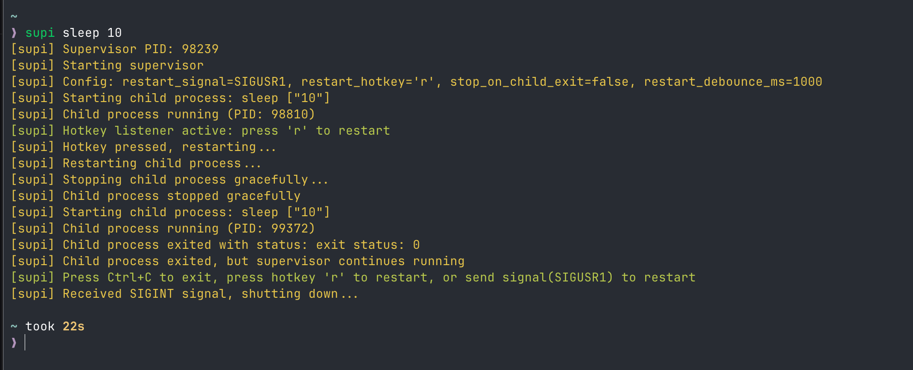

# supi - Simple Process Supervisor

A lightweight CLI tool for supervising and managing arbitrary processes with
easy restart capabilities.

[](https://crates.io/crates/supi-cli)

## Overview

`supi` is a simple process supervisor that spawns and manages child processes.
It allows you to restart processes on-demand using hotkeys or Unix signals,
making it ideal for development workflows where you need to frequently restart
services.

## Features

- **Process Management**: Spawns and supervises arbitrary commands
- **Signal Handling**: Responds to Unix signals for graceful shutdown and
  restart
- **Output Forwarding**: Forwards child process stdout and stderr in real-time
- **Interactive Restart**: Press a key to instantly restart your process
- **Flexible Configuration**: Customize restart signals and hotkeys

## Why?

I made myself a [zellij](https://zellij.dev/) (a rust terminal multiplexer, like
tmux) layout with various panels but most importantly with a panel on the left
for a `npm run build:app && npm run dev` command. This command builds the app
and then starts the development server. I wanted to be able to restart the
development server with a hotkey or signal. Since the app is really big with a
lot of components, I don't want to rebuild the app everytime I make a change. If
you look for this behavior, you might enjoy
[watchexec-cli](https://crates.io/crates/watchexec-cli).

## Core Behavior

### Output Forwarding

- All child process output (stdout and stderr) is forwarded as raw as possible
- No buffering or modification of child output
- Input is NOT forwarded to the child process by default (an "interactive" mode
  might be added in the future)

### Signal Handling

- **Restart Signal**: `SIGUSR1` (default) - Restarts the child process
- **Stop Signals**: Responds to standard termination signals (SIGTERM, SIGINT,
  etc.)
- Gracefully terminates child process before exiting

### Interactive Control

- Press the `r` key (default) to restart the child process
- Terminal must be focused for hotkey to work (not a global hotkey)

### Child Process Exit

- By default, supi continues running even if the child process exits
- Allows you to restart the process using signals or hotkeys
- Can be configured to exit when child exits using `--stop-on-child-exit`

## Usage

```bash
# Basic usage
supi <command> [args...]

# Example: Run a development server
supi npm run dev

# Example: Run a Rust application
supi cargo run

# Stop supi when child exits
supi --stop-on-child-exit ./my-script.sh
```

## Example: Start a Sleep Command for 10 seconds and reload before it finishes



## Example: Start multiple commands with "bash -c"

TODO: Add example

## Example: supi + zellij (a rust terminal multiplexer, like tmux)

TODO: Add example

## Command Line Options

### `--stop-on-child-exit`

**Default**: `false`

When enabled, supi will exit if the child process exits. When disabled
(default), supi continues running and you can restart the process using the
restart signal or hotkey.

```bash
supi --stop-on-child-exit npm start
```

### `--restart-signal <SIGNAL>`

**Default**: `SIGUSR1`

Specifies which Unix signal should trigger a process restart.

```bash
supi --restart-signal SIGUSR2 ./my-app
```

### `--restart-hotkey <KEY>`

**Default**: `r`

Specifies which key should trigger a process restart when pressed. Only works
when the terminal running supi is focused.

```bash
supi --restart-hotkey R ./my-app
```

### `--restart-debounce-ms <MILLISECONDS>`

**Default**: `1000` (1 second)

Sets the debounce time for restart requests in milliseconds. This prevents
accidental rapid restarts from multiple hotkey presses or signals. Set to `0` to
disable debouncing.

```bash
# Prevent restarts within 3 seconds of each other
supi --restart-debounce-ms 3000 npm run dev

# Disable debouncing (allow instant restarts)
supi --restart-debounce-ms 0 ./my-app
```

### `--log-color <COLOR>`

**Default**: `yellow`

Sets the color for supervisor log messages. Supported colors: `yellow`, `red`,
`green`, `blue`, `cyan`, `magenta`, `white`, `none`.

```bash
supi --log-color cyan npm run dev
```

### `--info-color <COLOR>`

**Default**: `green`

Sets the color for informational messages (like hotkey prompts). Supported
colors: `yellow`, `red`, `green`, `blue`, `cyan`, `magenta`, `white`, `none`.

```bash
supi --info-color blue npm run dev
```

### `--silent`

**Default**: `false`

Suppresses all supervisor output. Child process output remains visible. Useful
when you want to see only the output from your managed process.

```bash
supi --silent npm run dev
```

## Example Workflows

### Development Server with Quick Restart

```bash
# Start your dev server, press 'r' to restart anytime
supi npm run dev
```

### Production-like Supervisor

```bash
# Exit when the main process exits
supi --stop-on-child-exit ./production-app
```

### Custom Signal Integration

```bash
# Use SIGUSR2 for restart
supi --restart-signal SIGUSR2 python app.py

# In another terminal, send restart signal
kill -SIGUSR2 $(pgrep -f "supi python")
```

## Installation

### From crates.io (Recommended)

```bash
cargo install --locked supi-cli
```

### From Source

```bash
git clone https://github.com/bjesuiter/supi-cli
cd supi-cli
cargo install --path .
```

## Requirements

- Unix-like operating system (Linux, macOS)
- Rust 1.86 or higher (for building from source)

## Distribution Targets

Pre-built binaries might be provided later for:

- `aarch64-apple-darwin` - Apple Silicon macOS
- `x86_64-unknown-linux-gnu` - Linux with glibc
- `x86_64-unknown-linux-musl` - Linux static binary (portable)

Right now the main way to get supi is to install it from crates.io.

## License

Licensed under either of:

- Apache License, Version 2.0 ([LICENSE-APACHE](LICENSE-APACHE) or
  http://www.apache.org/licenses/LICENSE-2.0)
- MIT license ([LICENSE-MIT](LICENSE-MIT) or http://opensource.org/licenses/MIT)

at your option.

### Contribution

Unless you explicitly state otherwise, any contribution intentionally submitted
for inclusion in the work by you, as defined in the Apache-2.0 license, shall be
dual licensed as above, without any additional terms or conditions.

---

# Publishing Information

## For Maintainers

### Publishing a New Version to crates.io

1. **Update version** in `Cargo.toml`:
   ```toml
   version = "0.3.0"  # Bump from 0.2.0
   ```

2. **Update** `CHANGELOG.md` with changes in the new version

3. **Test everything**:
   ```bash
   cargo clean
   cargo build --release
   cargo test --release
   cargo package --list  # Check included files
   cargo publish --dry-run  # Test publication
   ```

4. **Commit changes**:
   ```bash
   git add Cargo.toml CHANGELOG.md
   git commit -m "Bump version to 0.3.0"
   git push
   ```

5. **Publish to crates.io**:
   ```bash
   cargo publish
   ```

6. **Tag the release**:
   ```bash
   git tag v0.3.0
   git push origin v0.3.0
   ```

7. **Verify installation**:
   ```bash
   cargo install --locked supi-cli --force
   supi --version
   ```

### Important Notes

- **Can't unpublish**: Published versions are permanent (can only be yanked)
- **Semantic versioning**: Follow semver for version numbers
- **Cargo.lock**: Users will install with `--locked` for reproducible builds
- **Test thoroughly**: Always run full test suite before publishing

---

# Development Information

This repository uses [bonnie/bx cli](https://github.com/codemonument/bx) as a
task runner. `bx` is a custom fork of bonnie with a shorter CLI name for
convenience.

See [bonnie.toml](bonnie.toml) for all available commands.

## Future Considerations and Improvements

The following features and enhancements are being considered for future
releases:

### Phase 7: Polish & Distribution

- **Comprehensive error handling**: Improve error messages and edge case
  handling
- **Enhanced status messages**: Add more informative status messages throughout
  the lifecycle
- **Cross-platform testing**: Thorough testing on various Linux distributions
  and macOS versions
- **CI/CD pipeline**: Set up automated cross-compilation for multiple platforms
- **Pre-built binaries**: Provide release binaries for common target platforms
- **Documentation improvements**: Expand examples and use case documentation
- **Examples directory**: Add practical examples for common workflows

### Phase 8: Vim-Style Interactive Mode (Future)

Add an optional interactive mode that allows switching between normal mode
(hotkeys active) and insert mode (stdin forwarded to child):

- **Normal Mode**: Current behavior - hotkeys active, no stdin forwarding
- **Insert Mode**: Forward stdin to child process, press ESC to return to normal
- **Mode Indicator**: Visual display of current mode (like vim)
- **Smooth Transitions**: Mode switching without disrupting child process

Use cases:

- Interactive shells or REPLs that need input
- Applications requiring both monitoring and interaction
- Development workflows mixing observation and interaction

### Phase 9: Optional TUI Mode (Future Enhancement)

An optional terminal UI mode (`--tui` flag) for enhanced monitoring:

- **Status Bar**: Process state, uptime, restart count
- **Scrollable Output**: Buffer for reviewing child stdout/stderr
- **Help Panel**: Available hotkeys and commands
- **Visual Indicators**: Process state visualization
  (running/stopped/restarting)
- **Customizable Refresh**: Configurable UI update rate

This would be opt-in, preserving the simple passthrough behavior by default.

### Other Potential Features (Out of Scope)

Features that might be explored much later:

- **Configuration file support**: TOML/KDL config files
- **Windows support**: Cross-platform signal equivalents
- **Process statistics**: Restart counter, uptime tracking, resource usage
